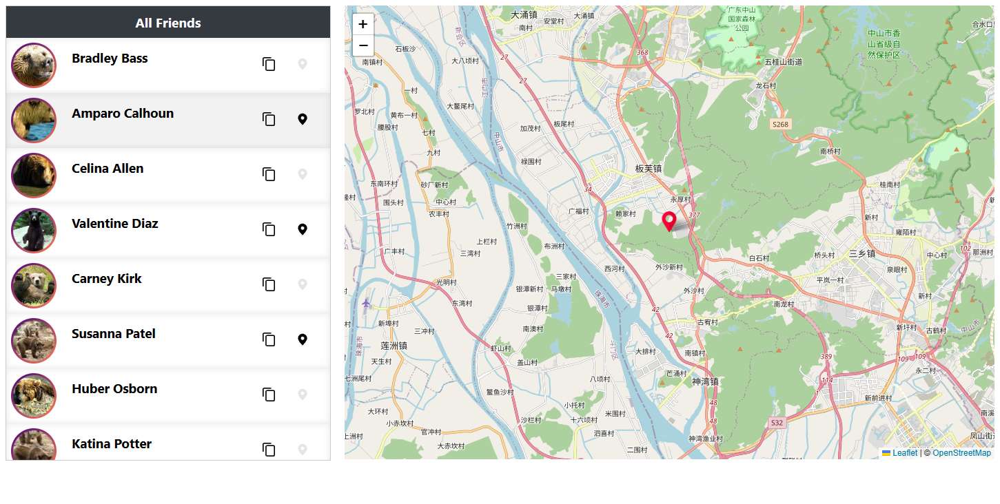

# geo-contacts-fe

**Geo-contacts** is a single-page web application (SPA) that displays a scrollable list of contacts alongside a navigable 2D world map.
Click on a contact card to reveal the contact's email address.
Utilize the "Copy Email" button to copy the email address to the clipboard.
Use the "Geolocate" button to pinpoint the contact's location on the map.

## Technologies Used

- Vue 3
- Typescript
- Pinia
- Vite
- Vitest
- Prettier
- Axios
- Leaflet

## Project Setup

### Prerequisites

- Node.js
- Yarn
- Docker (optional)

### Installation

```bash
# Clone the repository
git clone <repository-url>
cd geo-contacts
```

```bash
# Install dependencies
yarn install
```

### Compile and Hot-Reload for Development

```bash
yarn dev
```

Alternatively, you can use Docker to start the development server:
```bash
docker-compose up vueapp-dev --build
```

### Build for Production

```bash
docker-compose up vueapp-prod nginx-prod --build
```

### Access

- Development: [localhost:3000](http://localhost:3000)
- Production: [localhost:80](http://localhost:80)

### Run Unit Tests with [Vitest](https://vitest.dev/)

```bash
yarn test:unit
```

### Formatting with Prettier

```bash
yarn prettier:write
```
